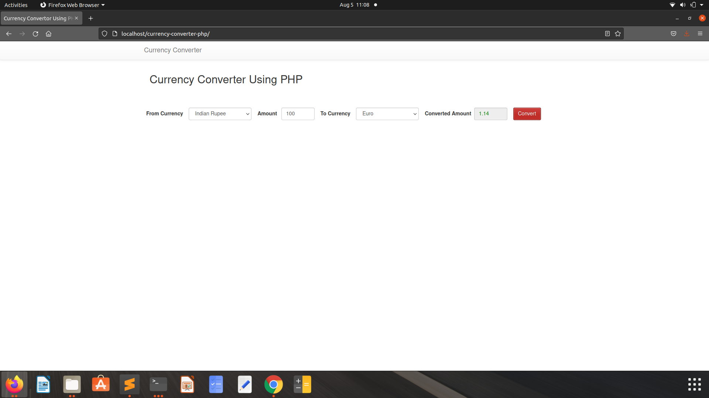

# Currency Converter

It is an API based currency converter where you can convert any currency in the world.


## Installation

Install my-project as zip or clone.

```bash
    git clone https://github.com/Yesh123456/Currency-Converter.git
```

Install PHP.(For Ubuntu)

```bash
     sudo apt install php
     sudo apt install php-admin
```
Install Lamp for running php files locally.

```bash
    sudo apt install lampp
```

Install Mysql.

```bash
    sudo apt install mysql
```

Create new database in PHP admin and import sql file 

Change dbconnection.php file accordingly.

## Features

- Relevent scheme
- Live previews
- Desktop version only
- Web Application

  
## Screenshots




## Feedback

If you have any feedback, please reach out to us at isco30427@gmail.com

  
## Badges

Add badges from somewhere like: [shields.io](https://shields.io/)

[](https://github.com/tterb/atomic-design-ui/blob/master/LICENSEs)
[](https://opensource.org/licenses/)
[](http://www.gnu.org/licenses/agpl-3.0)

  
